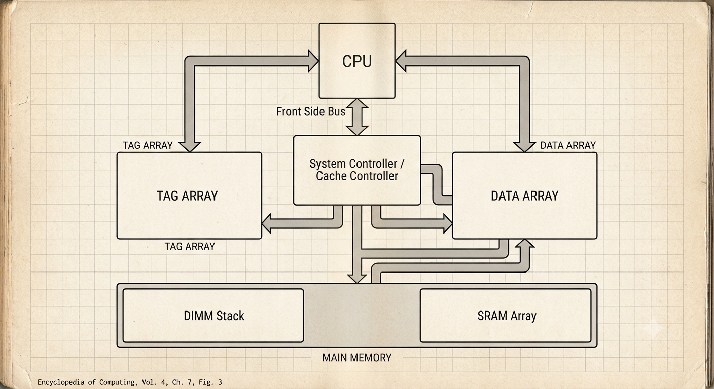
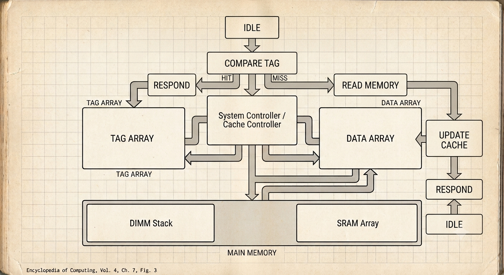

# 🖥️ Direct Mapped Cache Controller using Verilog


A synthesizable **32-bit Direct Mapped Cache Controller** implemented in **Verilog HDL**, demonstrating the fundamental principles of cache memory design in computer architecture. The project features cache hit/miss detection, cache refill from main memory, finite state machine (FSM) based control, and a modular RTL design suitable for simulation and synthesis.

> **Developed and simulated using Xilinx Vivado 2022.2**

---

## 📖 Project Overview

Cache memory plays a vital role in improving processor performance by reducing the average memory access time. This project implements a **Direct Mapped Cache**, where each memory block maps to exactly one cache line.

For every CPU memory request, the controller compares the requested tag with the stored cache tag.

* ✅ **Cache Hit:** Data is immediately returned to the CPU.
* ❌ **Cache Miss:** Data is fetched from main memory, stored in the cache, and then supplied to the CPU.

The design follows a modular architecture, making it easy to understand, simulate, and extend into more advanced cache organizations.

---

# ✨ Features

* ✔️ 32-bit Address Space
* ✔️ 32-bit Data Width
* ✔️ Direct Mapped Cache Organization
* ✔️ 16 Cache Lines
* ✔️ Tag Array
* ✔️ Data Array
* ✔️ Valid Bit Support
* ✔️ Cache Hit/Miss Detection
* ✔️ Main Memory Interface
* ✔️ FSM-Based Cache Controller
* ✔️ Parameterized Verilog Modules
* ✔️ Fully Synthesizable RTL
* ✔️ Comprehensive Testbench
* ✔️ Functional Simulation using Xilinx Vivado

---

# 🏗️ Cache Configuration

| Parameter     | Value         |
| ------------- | ------------- |
| Cache Type    | Direct Mapped |
| Address Width | 32 bits       |
| Data Width    | 32 bits       |
| Cache Lines   | 16            |
| Index Bits    | 4             |
| Offset Bits   | 2             |
| Tag Bits      | 26            |

### Address Format

```
+----------------------+---------+--------+
|       Tag (26)       | Index   | Offset |
+----------------------+---------+--------+
        31:6             5:2      1:0
```

---

# 🧩 Project Architecture



---

# ⚙️ Finite State Machine (FSM)

The cache controller is implemented using a five-state finite state machine.



---

# 📦 Module Description

## 🔹 cache_controller.v

Implements the control logic of the cache.

Responsibilities:

* Handle CPU read/write requests
* Perform tag comparison
* Detect cache hits and misses
* Generate memory read/write requests
* Update cache contents
* Control CPU response timing

---

## 🔹 tag_array.v

Stores:

* Cache Tags
* Valid Bits

Supports synchronous write operations and asynchronous read access.

---

## 🔹 data_array.v

Stores the cached 32-bit data words.

Supports synchronous writes and asynchronous reads.

---

## 🔹 memory_model.v

Behavioral model of the main memory used during simulation.

Provides:

* Memory Read
* Memory Write
* Memory Ready Signal

---

## 🔹 cache_top.v

Top-level integration module connecting all cache components into a complete subsystem.

---

## 🔹 cache_top_tb.v

Self-contained Verilog testbench used to verify the complete cache controller.

---

# 🧪 Simulation Test Cases

The following scenarios were verified successfully.

### ✅ Test 1 — First Read

**Address:** `0x00000020`

Expected:

* Cache Miss
* Main Memory Access
* Cache Update
* CPU Response

---

### ✅ Test 2 — Read Same Address Again

**Address:** `0x00000020`

Expected:

* Cache Hit
* Immediate Response

---

### ✅ Test 3 — Read New Address

**Address:** `0x00000040`

Expected:

* Cache Miss
* Memory Refill

---

### ✅ Test 4 — Write Operation

**Address:** `0x00000040`

**Data:** `0xDEADBEEF`

Expected:

* Cache Updated
* Main Memory Updated

---

### ✅ Test 5 — Read Updated Address

Expected:

* Cache Hit
* Updated Data Returned

---

### ✅ Test 6 — Access Another Address

**Address:** `0x00000080`

Expected:

* Cache Miss
* Cache Refill

---

# 📊 Simulation Results

The waveform verifies:

* ✔️ Cache Hit Detection
* ✔️ Cache Miss Detection
* ✔️ FSM State Transitions
* ✔️ Tag Comparison
* ✔️ Cache Refill
* ✔️ Data Update
* ✔️ Main Memory Access
* ✔️ CPU Ready Signal

---

# 🛠️ Tools Used

* **Verilog HDL**
* **Xilinx Vivado 2022.2**
* **Xilinx Simulator (XSim)**

---

# 🚀 Future Improvements

Potential extensions include:

* Two-Way Set Associative Cache
* Four-Way Set Associative Cache
* Write-Back Cache Policy
* Dirty Bit Implementation
* LRU Replacement Algorithm
* Burst Memory Transfers
* Multi-Level Cache Hierarchy
* Pipeline Processor Integration

---

# 🎯 Learning Outcomes

This project helped reinforce concepts in:

* Computer Architecture
* Cache Memory Organization
* Memory Hierarchy
* Direct Mapping
* RTL Design using Verilog
* Finite State Machine Design
* Hardware Verification
* Digital System Design
* FPGA-Oriented RTL Development

---

# 👩‍💻 Author

**Archita Roy**
**B.Tech – Electronics and Communication Engineering**
**National Institute of Technology Silchar**

GitHub: [@archita-2005](https://github.com/archita-2005)

---

## ⭐ If you found this project helpful, consider giving it a star!

Feedback and suggestions are always welcome.
